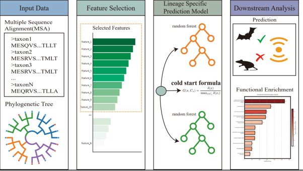

# CEP — 趋同进化预测

[English](README.md) | [中文](README_CN.md)

> **解码回声定位预测中的进化重复性**
>
> 一个基于系统发育序列的趋同性状预测框架（以回声定位为案例）。



---

CEP 框架以多序列比对（MSAs）和携带表型标记的系统发育树作为输入。其工作流程首先进行全蛋白质组范围内的特征筛选，以分离出高信噪比（high-SNR）的趋同位点。随后利用这些特征构建针对特定谱系的预测模型，以控制混杂的系统发育因素。输出结果包括一个稳健的性状预测模型，以及一系列优先排序的分子信号，用于下游的功能分析。

---

## 项目结构

```
CEP_project/
├── README_CN.md                      # 本文件（中文版）
├── README.md                         # 英文版
├── cep.png                           # 方法框架图
├── cep_draft_0523.pdf                # 论文草稿
│
├── src/                              # 核心源码
│   ├── config.py                     # 全局路径与参数配置
│   ├── leave_one_eval.py             # CEP 留一验证核心算法
│   ├── esl.py                        # ESL & ESL-PSC 分类器实现
│   └── __init__.py                   # 包初始化
│
├── scripts/                          # 可执行脚本
│   ├── msa_alignment.sh              # MAFFT 批量多序列比对
│   ├── preprocess.py                 # FASTA → CSV 批量转换
│   ├── generate_leave_one.py         # 生成 103_leave 预计算数据
│   ├── leave_one_run.py              # CEP 留一验证批量运行
│   ├── method_compare.py             # 四模型基线对比（LR, NB, SVM, RF）
│   ├── ablation_study.py             # CEP 消融实验（5 种变体）
│   ├── esl_eval.py                   # ESL 留一预测评估
│   ├── esl_psc_eval.py               # ESL-PSC 留一预测评估
│   └── eval_summary.py               # 一键评估汇总（指标 + 可视化）
│
├── notebook/                         # 分析 Notebook（论文图表复现）
│   ├── Fig_1a.ipynb                  # Fig 1a — 系统发育树
│   ├── Fig_1b.ipynb                  # Fig 1b — 互信息分布
│   ├── Fig_1c.ipynb                  # Fig 1c — Prestin 序列相似性
│   ├── Fig_1_de.ipynb                # Fig 1d–e — 趋同突变累积分布
│   ├── Fig_3_and_Fig4.ipynb          # Fig 3–4 — 方法对比与评估
│   ├── Fig_5.ipynb                   # Fig 5 — Top 基因富集与 PPI
│   ├── ori_cep.ipynb                 # 原始 CEP 实现（参考）
│   ├── ori_esl.ipynb                 # 原始 ESL/ESL-PSC 实现（参考）
│   ├── ori_ml.ipynb                  # 原始 ML 方法评估（参考）
│   └── ori_ablation.ipynb            # 原始消融实验（参考）
│
├── data/                             # 数据目录
│   ├── metadata/                     # 物种元数据
│   │   ├── metadata.csv              #   基础元数据（191 物种）
│   │   ├── metadata_1.csv            #   扩展元数据（含中文名、目分类）
│   │   ├── idx2gene.txt              #   特征索引 → 基因名映射
│   │   ├── args_train.json           #   训练参数配置
│   │   └── mapdic.json               #   物种名映射表
│   ├── fasta_717/                    # 717 个基因的原始 FASTA（192 物种）
│   ├── msa_output_717/               # MAFFT 比对结果（.aln）
│   ├── msa_df_717/                   # MSA 转换后的 CSV（每基因一个文件）
│   ├── feature_data/                 # 特征矩阵缓存（Parquet）
│   └── leave_one/                    # 留一验证预计算数据（104 个物种目录）
│
├── results/                          # 输出结果
│   ├── logs/                         #   CEP 预测日志
│   ├── method_compare/               #   四模型预测与训练准确率
│   ├── ablation_study.csv            #   消融实验结果
│   ├── esl_eval.csv                  #   ESL 预测结果
│   ├── esl_psc_eval.csv              #   ESL-PSC 预测结果
│   ├── compare_eval_plot.svg         #   方法对比热图
│   ├── ablation_eval_plot.svg        #   消融实验热图
│   ├── feature_count_*.svg           #   单模型特征数分析图（4 张）
│   ├── all_methods_pred.csv          #   所有方法逐物种预测
│   ├── all_methods_metrics.csv       #   各方法指标汇总
│   └── all_methods_errors.csv        #   各方法误判物种清单
│
└── .gitignore
```

---

## 环境依赖

### Python 包

```bash
pip install numpy pandas scipy scikit-learn matplotlib seaborn \
            tqdm group-lasso Bio
```

### 外部工具

| 工具 | 用途 |
|------|------|
| MAFFT | 多序列比对 |

---

## 复现步骤

### Step 0：配置路径

编辑 `src/config.py`，确认各数据目录路径正确。

```python
# src/config.py — 关键变量
CEP_ROOT     # 项目根目录（自动检测）
DATA_DIR     # data/ 目录
N_CPU = 64   # 多进程默认 CPU 数
```

---

### Step 1：数据预处理

**输入**：OrthoMam v10（190 物种 CDS）+ 鼩鼹、猪尾鼠自有数据  
**输出**：`data/msa_df_717/` 下的 CSV 文件（每基因一个文件，行=物种，列=去 gap 后位点）

> 论文分析中产生过两个版本的 MSA 结果。第一版为 OrthoMam v10 全部 190 物种约 15k 基因的 MSA；第二版在基因层面仅保留存在某个突变位点 MI ≥ 0.35 的互信息基因（716 个），并在 FASTA 中加入鼩鼹、猪尾鼠后对 192 物种重新做 MSA。本仓库仅包含第二版 717 个基因（含 1 个无已知 gene symbol 的基因）的原始 FASTA 供复现。

```bash
# 1. MAFFT 多序列比对
bash scripts/msa_alignment.sh data/fasta_717 data/msa_output_717

# 2. MSA .aln → CSV
#    - 解析 .aln 为 species × position DataFrame
#    - 非标准氨基酸替换为 '-'
#    - 删除 Homo_sapiens 中为 gap 的位点
#    - 列名格式：{gene_id}_{position}
python scripts/preprocess.py \
    --fasta-dir data/msa_output_717 \
    --metadata data/metadata/metadata_1.csv \
    --output-dir data/msa_df_717
```

---

### Step 2：特征分析 — Result 1

论文 Fig 1 的复现 Notebook：

| 分析内容 | Notebook | 论文图表 |
|----------|----------|----------|
| 系统发育树 | `notebook/Fig_1a.ipynb` | Fig 1a |
| 互信息分布 | `notebook/Fig_1b.ipynb` | Fig 1b |
| Prestin 序列相似性 | `notebook/Fig_1c.ipynb` | Fig 1c |
| 趋同突变累积分布 | `notebook/Fig_1_de.ipynb` | Fig 1d–e |

---

### Step 3：CEP 留一验证

#### 3.1 生成 103_leave 预计算数据

为每个物种预计算 leave-one-out 特征排序。

```bash
python scripts/generate_leave_one.py \
    --csv-dir data/msa_df_717 \
    --metadata data/metadata/metadata_1.csv \
    --output-dir data/leave_one \
    --top-k 20000 \
    --save-summary \
    --n-cpu 64
```

**输出**（`data/leave_one/{species_id}/`）：  
- `df_feature.csv` — 特征矩阵（103 物种 × top-K 特征）  
- `df_meta.csv` — 元数据（103 行，含 label、order_chinese_new）  
- `df_summary.csv` — 特征评分（NMI、eco_cover、score 等）

#### 3.2 运行 CEP 预测

```bash
python scripts/leave_one_run.py --top-k 500 --n-cpu 64
```

**CEP 预测策略**：
- 翼手目 / 鲸目：使用 **RandomForest**（top 10 特征，n_estimators=100）
- 其他目：使用趋同突变计数法（eco_mutation count vs ref_max）
- 特征排序：cover_score × NMI

**输出**：`results/logs/cep_leave_one_*.csv`

---

### Step 4：方法对比与评估 — Result 3 & 4

#### 4.1 脚本一键运行

```bash
# CEP 留一验证（Step 3.2）
python scripts/leave_one_run.py --top-k 500 --n-cpu 64

# 四模型基线对比（LR / NB / SVM / RF，特征数 1–30）
python scripts/method_compare.py --max-feature 30 --n-cpu 64

# 消融实验（5 种 CEP 变体）
python scripts/ablation_study.py --n-cpu 64

# ESL 评估
python scripts/esl_eval.py --n-cpu 32

# ESL-PSC 评估
python scripts/esl_psc_eval.py --n-cpu 32
```

#### 4.2 结果汇总（一键脚本）

```bash
# 自动收集所有方法结果 → 计算指标 → 生成可视化热图
python scripts/eval_summary.py
```

**输出**：

| 文件 | 说明 |
|------|------|
| `compare_eval_plot.svg` | 方法对比热图（CEP / ESL / ESL-PSC / RF / LR / NB / SVM） |
| `ablation_eval_plot.svg` | 消融实验热图（5 种 CEP 变体） |
| `feature_count_*.svg` | 单模型特征数分析图（4 张，展示 1–30 特征下的 error 和指标变化） |
| `all_methods_pred.csv` | 所有方法逐物种预测 |
| `all_methods_metrics.csv` | 各方法 Accuracy / Precision / Recall / F1 |
| `all_methods_errors.csv` | 各方法误判物种清单 |

#### 4.3 Notebook 可视化

| 分析内容 | Notebook |
|----------|----------|
| 方法对比 + CEP 评估 | `notebook/Fig_3_and_Fig4.ipynb` |
| ESL / ESL-PSC 结果 | `notebook/ori_esl.ipynb` |

---

### Step 5：基因重要性分析 — Result 5

| 分析内容 | Notebook |
|----------|----------|
| Top 30 基因位点重要性 & GSEA 富集 | `notebook/Fig_5.ipynb` |
| PPI 网络（STRING 数据库） | `notebook/Fig_5.ipynb` |

---

## 数据说明

### metadata/metadata.csv

基础元数据（191 物种）：
- `split`：数据划分标识
- `label`：回声标签（0=非回声, 1=回声, 2=未知）
- `order`：谱系分组

### metadata/metadata_1.csv

扩展元数据，增加：
- `species_chinese`：物种中文名
- `order_chinese` / `order_chinese_new`：中文目分类

### data/leave_one/

每个物种一个子目录，包含：
- `df_feature.csv`：特征矩阵（已排序）
- `df_meta.csv`：元数据
- `df_summary.csv`：特征评分汇总

---

## 引用

如使用本方法，请引用相关论文（待发表后更新）。
